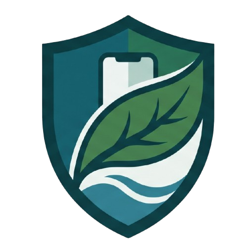

<div align="center">
  
  <h1 align="center"><span style="color:#2ecc71">MiSTech</span></h1>
  <p align="center">
    <strong>Aplikasi Edukasi Bencana Alam</strong>
  </p>
  <p align="center">
    
    
    
  </p>
</div>

<br />

## 📌 Tentang Proyek

**MiSTech** adalah aplikasi *mobile* berbasis Flutter yang dirancang khusus sebagai platform edukasi interaktif tentang mitigasi dan penanganan bencana alam. Aplikasi ini mengintegrasikan pembelajaran multimedia dan kecerdasan buatan (Machine Learning) untuk memberikan pengalaman belajar yang komprehensif, modern, dan tanggap darurat.

## ✨ Fitur Utama

- 🟢 **Materi Edukasi Interaktif**: Modul pembelajaran lengkap mengenai berbagai jenis bencana alam.
- 🟢 **Deteksi Cerdas (Machine Learning)**: Fitur pengenalan berbasis kamera menggunakan TensorFlow Lite.
- 🟢 **Multimedia & Video Pembelajaran**: Integrasi pemutar video untuk visualisasi mitigasi secara langsung.
- 🟢 **Simulasi & Animasi**: Visualisasi yang menarik dan mudah dipahami dengan Lottie.
- 🟢 **Akses Offline & Mode Darurat**: Penyimpanan lokal untuk memastikan materi tetap dapat diakses saat minim konektivitas.
- 🟢 **Navigasi Cepat & Dinamis**: Perpindahan antarmuka yang mulus dan intuitif.

## 🛠️ Teknologi & Stack

Aplikasi ini dibangun menggunakan *best-practices* dengan *library* modern:

| Kategori | Teknologi / Package Utama |
| :--- | :--- |
| **Framework** | Flutter (SDK ^3.11.4) |
| **State Management** | Provider |
| **Routing** | Go Router |
| **Machine Learning** | TFLite Flutter, Camera |
| **Media & UI** | Video Player, Chewie, Lottie, Flutter Animate, Shimmer |
| **Network** | Dio, HTTP |
| **Storage** | Shared Preferences, Cache Manager |

## 🚀 Panduan Instalasi (Getting Started)

### Prasyarat Sistem
Pastikan *environment* Anda sudah siap:
- [Flutter SDK](https://docs.flutter.dev/get-started/install) (versi 3.11.4+)
- Android Studio / Visual Studio Code
- Emulator atau Perangkat Fisik (Android/iOS)

### Langkah Instalasi

1. **Clone Repositori**
   ```bash
   git clone https://github.com/your-username/mistech-app.git
   cd mistech-app
   ```

2. **Unduh Dependensi**
   ```bash
   flutter pub get
   ```

3. **Jalankan Aplikasi**
   ```bash
   flutter run
   ```

## 📂 Struktur Direktori

Gambaran umum arsitektur proyek:

```text
mistech-app/
├── assets/               # Aset lokal (ikon, gambar, font, model ML, audio)
├── lib/
│   ├── main.dart         # Entry point aplikasi
│   ├── core/             # Konstanta, tema (warna, tipografi), dan utilitas
│   ├── features/         # Logika dan UI berdasarkan modul/fitur
│   └── routes/           # Konfigurasi navigasi (GoRouter)
└── pubspec.yaml          # Konfigurasi project dan dependensi
```

## 🤝 Kontribusi

Kami menyambut baik segala bentuk kontribusi! Jika Anda menemukan *bug* atau ingin menambahkan fitur baru, silakan buat *Pull Request* atau laporkan pada tab *Issues*.

---
<div align="center">
  <b>Dibuat dengan <span style="color:#2ecc71">💚</span> untuk edukasi dan keselamatan bersama.</b>
</div>
